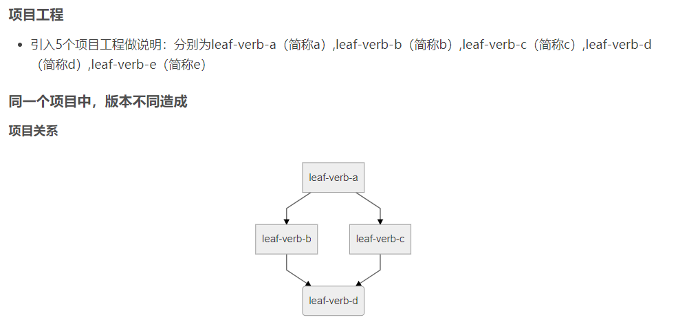
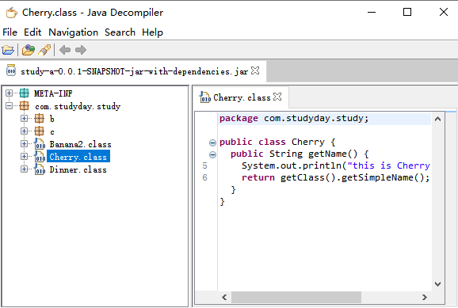

1.maven 对于同名类是如何合并的,能不能合并？
1.1 
a.jar
  |-Demo1.class
  |-Demo2.class

b.jar
  |-Demo1.class
目标：如何使用b.jar中的demo1.class替换a.jar中的demo1中的demo1.class
使用场景，a.jar是一个大的整体模块，b.jar是新分支中定制开发的一部分功能。要保留a.jar中的所有代码，保持git上代码可以跨分支合并。且要在打包时使用b.jar中修改的代码，覆盖a.jar中demo1.class代码。如果产生冲突将冲突限制在pom文件中。避免在代码中出现大量的代码冲突。

2.利用maven强制替换目标class。确定是维护更新有问题，可能出现同名重复维护，少维护，维护错误的问题。

3要做到局部到吗覆盖，还可以使用同名java类，覆盖依赖中的class文件。

如果拆分后，也不能解决2中存在的问题，可以借助IDE工具区分。拆分的话原来和2稍有差别，是显示的在pom中做的替换。

实现操作

将依赖a放在依赖b之前，执行c中App.java 中的main方法 ，此时根据打印使用a.jar中的类。
将依赖b放在依赖a之前，执行c中App.java 中的main方法 ，此时根据打印使用b.jar中的类。

结论：maven的顺序真的会影响具体执行的是哪个类。

通过查找资料发现，这个是jvm类加载器造成的

jvm的类加载采用双亲委托模型，一旦类被类加载器加载一次后就不会再加载第二次，一旦我们项目中出现重名的类，就有可能因为类加载器的顺序，导致bug出现。

拓展疑问

为什么之前基于war包的tomcat部署方式没有出现过这种问题呢？

tomcat重写了自己的类加载器，加载顺序如下：
```
$java_home/lib 目录下的java核心api
$java_home/lib/ext 目录下的java扩展jar包
java -classpath/-Djava.class.path所指的目录下的类与jar包
$CATALINA_HOME/common目录下按照文件夹的顺序从上往下依次加载
$CATALINA_HOME/server目录下按照文件夹的顺序从上往下依次加载
$CATALINA_BASE/shared目录下按照文件夹的顺序从上往下依次加载
项目路径/WEB-INF/classes下的class文件
项目路径/WEB-INF/lib下的jar文件
```
这个也解释了为什么 自定义java可以覆盖 jar里的文件了。

延申：https://www.cnblogs.com/lanxuezaipiao/p/4138511.html

jvm的类加载采用双亲委托模型 为什么还会jar包冲突？

#### 问题1 以上操作会不会产生冲突？可能产生冲突的点在哪里？

引用：https://blog.csdn.net/ycccsdn/article/details/90549347

造成jar包冲突的原因主要有两种

```
1. 第一种是一个项目，依赖了同一个项目的两个版本。
2. 第二种冲突原因是不同项目中,出现了相同的类。何为相同的类，即类的全限定名相同。
```

### 实验1



开始仿照上面的思路操作

第一步，构建四个空项目。

第二步，在项目study-e中加入代码

```
public class Banana {
	public String getName() {
		System.out.println("this is Banana， delicious！");
		return this.getClass().getSimpleName();
	}
}
```

第三步，当前E的版本是0.0.1-SNAPSHOT ，执行mvn install 将依赖加入到本地仓库中。

第四步，模拟删除了Banana类。同事修改版本为0.0.2-SNAPSHOT。新增Cherry 类

```


/**

 * 
 * Banana2由 Banana重命名。模拟删除了Banana类。同事修改版本为0.0.2-SNAPSHOT
 * Hello world!
   *
    */
   public class Banana2 {
   public String getName() {
   	System.out.println("this is Banana， delicious！");
   	return this.getClass().getSimpleName();
   }
   }
```

```
public class Cherry {
	public String getName() {
		System.out.println("this is Cherry， delicious！");
		return this.getClass().getSimpleName();
	}
}
```

第五步，study-b，study-c代码

```java

package com.studyday.study.b;

import com.studyday.study.Banana;

/**

 * Hello world!
   *
    */
   public class Fruit {
   public void eatFruit() {
   	Banana banana = new Banana();
   	String name = banana.getName();
   	System.out.println("b" + name);

   }
   }
```

```
 </dependency>
    	<dependency>
			<groupId>com.sutdyday</groupId>
			<artifactId>study-e</artifactId>
			<version>0.0.1-SNAPSHOT</version>
		</dependency>
  </dependencies>
```

------


```java

package com.studyday.study.c;

import com.studyday.study.Cherry;

/**

 * Hello world!
   *
    */
   public class Fruit {
   public void eatFruit() {
   	Cherry banana = new Cherry();
   	String name = banana.getName();
   	System.out.println("b" + name);

   }
   }
```

```
		<dependency>
			<groupId>com.sutdyday</groupId>
			<artifactId>study-e</artifactId>
			<version>0.0.2-SNAPSHOT</version>
		</dependency>
```

第六步，study-a中代码，注意pom依赖顺序与错误日志的关系

```
public class Dinner {
	public void eat() {
		com.studyday.study.b.Fruit fruit = new com.studyday.study.b.Fruit();
		fruit.eatFruit();
		com.studyday.study.c.Fruit eatFruit = new com.studyday.study.c.Fruit();
		eatFruit.eatFruit();

	}

	public static void main(String[] args) {
		Dinner dinner = new Dinner();
		dinner.eat();
	}
}
```

```
		<dependency>
			<groupId>com.sutdyday</groupId>
			<artifactId>study-b</artifactId>
			<version>0.0.1-SNAPSHOT</version>
		</dependency>

		<dependency>
			<groupId>com.sutdyday</groupId>
			<artifactId>study-c</artifactId>
			<version>0.0.1-SNAPSHOT</version>
		</dependency>
```

```
this is Banana， delicious！
bBanana
Exception in thread "main" java.lang.NoClassDefFoundError: com/studyday/study/Cherry
	at com.studyday.study.c.Fruit.eatFruit(Fruit.java:11)
	at com.studyday.study.Dinner.eat(Dinner.java:8)
	at com.studyday.study.Dinner.main(Dinner.java:14)
Caused by: java.lang.ClassNotFoundException: com.studyday.study.Cherry
	at java.net.URLClassLoader.findClass(URLClassLoader.java:381)
	at java.lang.ClassLoader.loadClass(ClassLoader.java:424)
	at sun.misc.Launcher$AppClassLoader.loadClass(Launcher.java:335)
	at java.lang.ClassLoader.loadClass(ClassLoader.java:357)
	... 3 more
```

当b在前则c项目报错NoClassDefFoundError: com/studyday/study/Cherry。如果c项目在前，则b项目报错 NoClassDefFoundError: com/studyday/study/Banana

### 实验2


借助上一个实验来做第二个实验

第一步，新增study-d项目添加代码

```
public class Cherry {
	public String hello() {
		System.out.println("this is Cherry， delicious！");
		return this.getClass().getSimpleName();
	}
}
```

第二步，修改study-c项目代码

第三步，执行study-a的方法

```
		<dependency>
			<groupId>com.sutdyday</groupId>
			<artifactId>study-b</artifactId>
			<version>0.0.1-SNAPSHOT</version>
		</dependency>
		<dependency>
			<groupId>com.sutdyday</groupId>
			<artifactId>study-c</artifactId>
			<version>0.0.1-SNAPSHOT</version>
		</dependency>
```

```
this is Cherry， delicious！
bCherry
Exception in thread "main" java.lang.NoSuchMethodError: com.studyday.study.Cherry.getName()Ljava/lang/String;
	at com.studyday.study.c.Fruit.eatFruit(Fruit.java:12)
	at com.studyday.study.Dinner.eat(Dinner.java:8)
	at com.studyday.study.Dinner.main(Dinner.java:14)

```

```
		<dependency>
			<groupId>com.sutdyday</groupId>
			<artifactId>study-c</artifactId>
			<version>0.0.1-SNAPSHOT</version>
		</dependency>
		<dependency>
			<groupId>com.sutdyday</groupId>
			<artifactId>study-b</artifactId>
			<version>0.0.1-SNAPSHOT</version>
		</dependency>
```

```
Exception in thread "main" java.lang.NoSuchMethodError: com.studyday.study.Cherry.hello()Ljava/lang/String;
	at com.studyday.study.b.Fruit.eatFruit(Fruit.java:13)
	at com.studyday.study.Dinner.eat(Dinner.java:6)
	at com.studyday.study.Dinner.main(Dinner.java:14)

```

对比，由于只加载两个类。而且每个类中方法改变了。改变maven的顺序，导致后面加载的项目依赖的类的方法会找不到。


知道了冲突时如何产生的。解决冲突的思路也是一样得的。

代码已经改承了实验2中的代码，如果需要复现实验1中的代码可以使用文档中的代码覆盖。

第三种jar报冲突是字段缺失和第二种方法缺失类似。


回答问题1 ，是可能出现冲突的，避免冲突的办法是版本统一管理。冲突是类级别的，不是方法级别的，和类加载器的机制有关。更和代码有关。

经验总结
使用同一个版本号，避免出现重名的Java文件。

在实现2 的基础上打包发现只有一个Cherry.class。且使用的是study-e里面的。在查看pom依赖顺序，A中依赖的C和B。C在B前，且C依赖的是E，而E中的方法名字刚好是getName()。从打包的角度对实验进行了验证。

